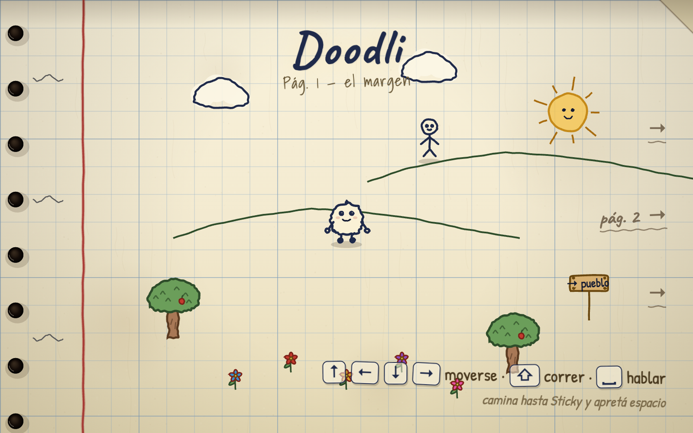
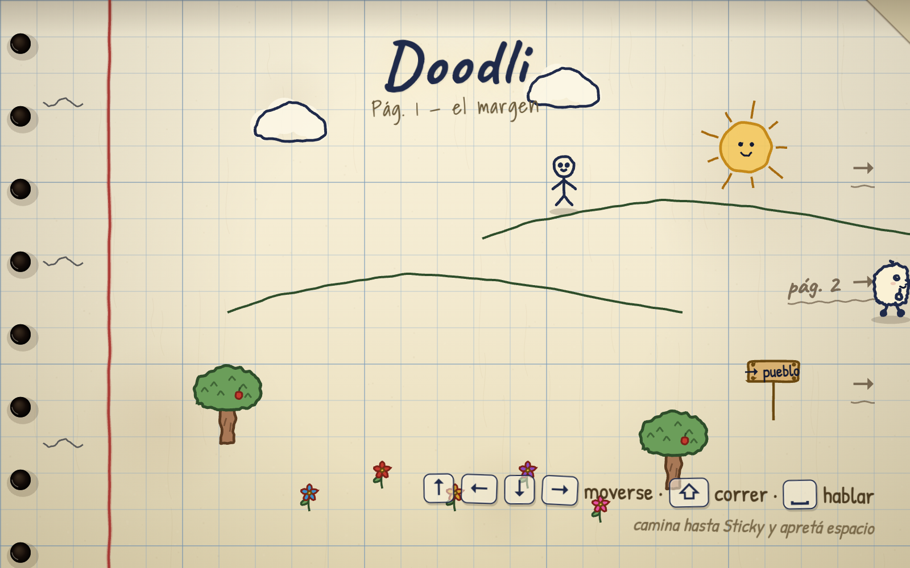

<div align="center">



# ✏️ Doodli

**Un JRPG hecho a mano sobre una página de cuaderno: camina por el papel, habla con los garabatos y entra en combates por turnos con muchísimo "juice".**

[](https://gavilanbe.github.io/doodli/)


</div>

---

## ✏️ Qué es esto

Doodli es un JRPG dibujado a mano sobre una página de cuaderno. Caminas por el papel celda a celda, hablas con los garabatos que lo habitan y entras en combates por turnos al estilo Golden Sun: introducción con barridos de tinta, HUD de cuatro paneles y golpes con flair visual —lápiz, marcador, salpicaduras de tinta y números de daño flotantes—. Todo el arte está dibujado en código con trazo "hervido" (*boiling line*): cada línea tiembla frame a frame, igual que las decoraciones del mundo, que también laten. El paso entre escenas se resuelve con una transición de página tipo "flip" físico.

## 🎮 Cómo se juega

| Tecla | Acción |
|---|---|
| `↑` `↓` `←` `→` / `W` `A` `S` `D` | Moverse |
| `Shift` | Correr |
| `Espacio` | Hablar |

## 📸 Capturas

| Por la página | En combate |
|:--:|:--:|
|  |  |

## ▶️ Jugar

La forma más fácil: **[gavilanbe.github.io/doodli](https://gavilanbe.github.io/doodli/)**.

### En local

```bash
git clone https://github.com/gavilanbe/doodli.git
cd doodli
python3 -m http.server 8000
# abre http://localhost:8000
```

## 🛠️ Bajo el capó

- **JavaScript (módulos ES)** sobre Canvas 2D, sin frameworks ni paso de build.
- Primitivas propias de dibujo a mano alzada (`sketch.js`) con trazo hervido (*boiling line*).
- Movimiento por celdas con interpolación suave y personaje en cuatro direcciones.
- Sistema de **diálogos** con retratos y expresiones; **combate por turnos** con HUD de cuatro paneles.
- Transición de página tipo "flip"; papel cuadriculado renderizado una sola vez por rendimiento.
- Tipografías manuscritas "Caveat" / "Patrick Hand".

## 📦 Créditos

Parte de mi colección de juegos. Publicado por [**@gavilanbe**](https://github.com/gavilanbe).

## 📄 Licencia

[MIT](LICENSE)

<div align="center"><sub>HECHO A MANO · 2026</sub></div>
